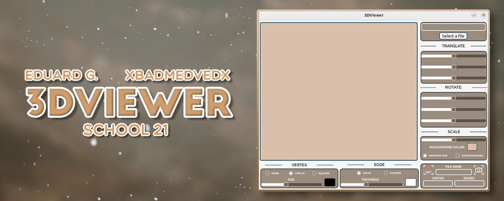
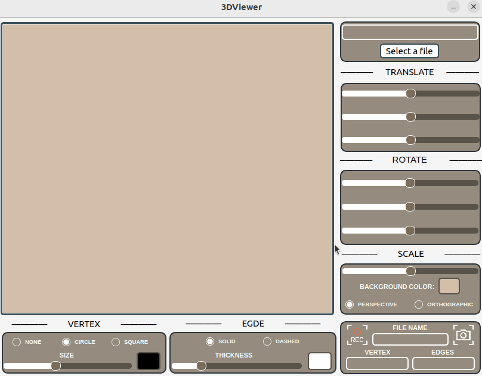
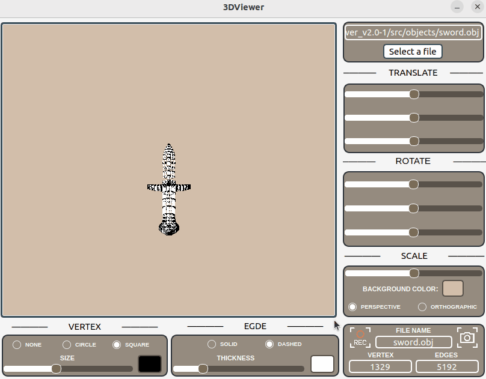
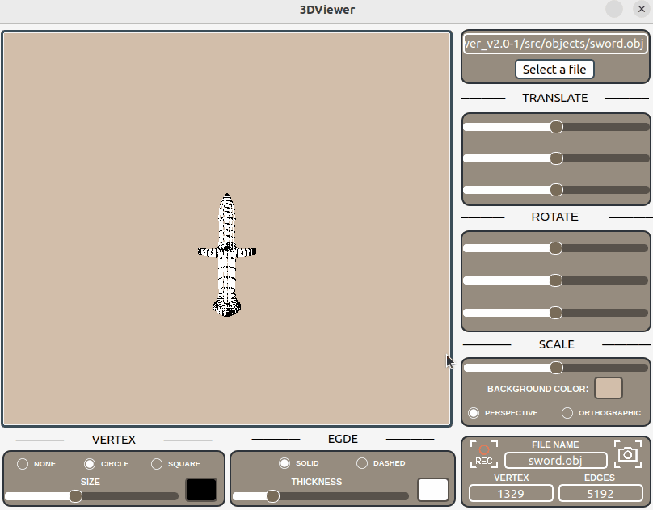
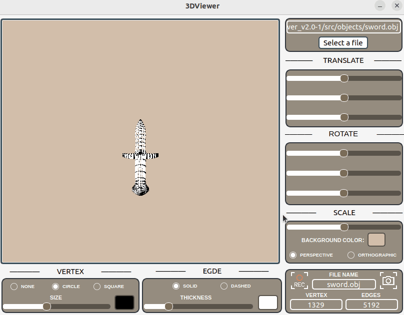
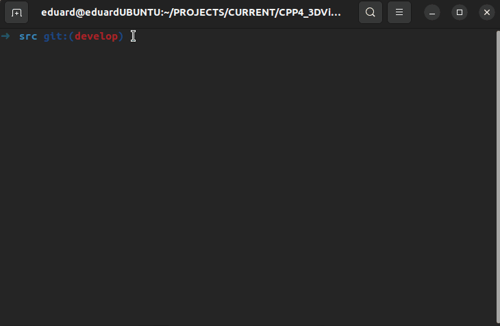

# 3DViewer v2.0

**3DViewer v2.0** - это обновленная версия программы для визуализации 3D моделей, которая предлагает пользователям улучшенный опыт работы с каркасными моделями благодаря реализации на C++ и использованию паттернов проектирования. Это значительное развитие по сравнению с предыдущей версией, модель которой была написана на языке C. Новая версия включает в себя передовые возможности и переработанный пользовательский интерфейс, предоставляя более гибкие инструменты для визуализации и анализа 3D моделей.

## Содержание

- [Особенности](#особенности)
- [Участники проекта](#участники-проекта)
- [Обзор программы](#обзор-программы)
- [Установка](#установка)
- [Unit-тесты](#unit-тесты)
- [Техническое задание](#техническое-задание)
  - [Основное задание](#основное-задание-реализация-3dviewer-v20)
  - [Первое дополнительное задание](#первое-дополнительное-задание-настройки)
  - [Второе дополнительное задание](#второе-дополнительное-задание-запись)

## Особенности

- **Поддержка формата .obj**: Программа может читать и отображать 3D модели в популярном формате .obj, что делает ее совместимой с большинством моделей, созданных в различных 3D редакторах.
- **Аффинные преобразования**: Пользователи могут перемещать, вращать и масштабировать модели в трехмерном пространстве, используя интуитивно понятный интерфейс.
- **Высокая производительность**: Оптимизированные алгоритмы обработки обеспечивают плавное отображение моделей, включая те, что содержат до 1 000 000 вершин.
- **Графический пользовательский интерфейс**: Удобный и функциональный GUI, поддерживающий различные операционные системы и GUI-библиотеки.
- **Расширенные настройки визуализации**: Пользователи могут настраивать тип проекции, а также внешний вид модели, включая цвет и толщину ребер, а также цвет фона.
- **Сохранение и запись**: Возможность сохранять изображения в форматах bmp и jpeg, а также создавать gif-анимации текущих преобразований модели.
- **Модульное тестирование и документация**: Программа сопровождается полным набором unit-тестов для ключевых функций и хорошей документацией.

Эти особенности делают **3DViewer v2.0** мощным инструментом для визуализации и анализа 3D моделей, доступным для широкого круга пользователей, от студентов и хоббистов до профессионалов в области 3D моделирования.

## Участники проекта

| Имя       | Обязанности и вклад                                                                                                                    |
|-----------|----------------------------------------------------------------------------------------------------------------------------------------|
|  **―― EDUARD G. ――** | - Парсер .obj файлов   - Дизайн и интерфейс   - Логика приложения   - Code review   - Создание документации   - Аффинные преобразования                |
|  **―― xBadMedVedx ――**  | - Помощь в тестировании программы   - Создание Unit Test'ов |

Каждый участник команды внес уникальный вклад в разработку проекта **3DViewer v2.0**, обеспечивая его высокое качество и широкие функциональные возможности.

## Обзор программы

### Основной вид

Основной вид интерфейса программы **3DViewer v2.0**, показывающий стандартную загруженную 3D модель. Этот вид является отправной точкой для работы с программой, предоставляя пользователям доступ к основным функциям визуализации и управления моделями.

### Изменение отображения вершин и граней

Демонстрация настройки визуального представления модели, включая изменение отображения вершин и граней. Пользователи могут выбрать различные способы визуализации, например, отображение только вершин, только граней, или обоих элементов, а также настраивать их цвет и стиль.

### Аффинные преобразования

Показывает процесс выполнения аффинных преобразований над моделью, включая перемещение, вращение и масштабирование. Эти инструменты позволяют пользователям детально исследовать модель, изменяя её положение и размер в трехмерном пространстве.

### Изменение проекции

Иллюстрирует возможность изменения типа проекции модели. Пользователи могут переключаться между различными видами проекции, такими как параллельная и перспективная, для изменения восприятия глубины и пространственных отношений в модели.

### Сохранение в PNG

Демонстрирует процесс сохранения текущего вида модели в файл изображения формата BMP или JPEG. Эта функция позволяет пользователям экспортировать результаты работы с моделью для использования в презентациях, отчетах или для дальнейшей обработки в графических редакторах.

### Сохранение в GIF

Здесь демонстрируется возможность записи действий пользователя с моделью в анимированный файл формата GIF. Эта функциональность идеально подходит для создания демонстрационных материалов, показывающих процесс работы с моделью, её аффинные преобразования, изменения в настройках визуализации и другие операции.

## Установка

**Требования**: Установленные `gcc`, `make` и `qmake6`.

### Цели MAKEFILE:

- **install** \
    Устанавливает программу в папку build.

- **uninstall** \
    Удаляет программу.

- **dvi** \
    Открывает документацию по проекту.

- **dist** \
    Генерирует дистрибутив .tgz с исполняемым файлом и необходимой документацией.

- **test** \
    Запуск тестирования модулей.

- **gcov_report** \
    Генерирует html отчет с отображением покрытия всех функций тестами.

- **valgrind** \
    Инициализирует проверку проекта с помощью valgrind.

## Unit-тесты

Ниже представлена гифка, демонстрирующая процесс выполнения и результаты Unit-тестов программы **3DViewer v2.0**. Эти тесты обеспечивают верификацию корректности работы ключевых компонентов программы, включая парсинг файлов формата .obj и аффинные преобразования.

Тестирование является важной частью разработки программного обеспечения, поскольку помогает обнаруживать и исправлять ошибки на ранних этапах. В **3DViewer v2.0** используется набор Unit-тестов для обеспечения стабильности и надежности программы.

## Техническое задание

### Основное задание. Реализация 3DViewer v2.0 

Необходимо разработать программу для визуализации каркасной модели в трехмерном пространстве.

- Программа должна быть разработана на языке C++ стандарта C++17;
- Код программы должен находиться в папке src;
- При написании кода необходимо придерживаться Google Style;
- Сборка программы должна быть настроена с помощью Makefile со стандартным набором целей для GNU-программ: all, install, uninstall, clean, dvi, dist, tests. Установка должна вестись в любой другой произвольный каталог;
- Программа должна быть разработана в соответствии с принципами объектно-ориентированного программирования, структурный подход запрещен;
- Должно быть обеспечено полное покрытие unit-тестами модулей, связанных с загрузкой моделей и аффинными преобразованиями;
- В один момент времени должна быть только одна модель на экране;
- Программа должна предоставлять возможность:
    - Загружать каркасную модель из файла формата obj (поддержка только списка вершин и поверхностей);
    - Перемещать модель на заданное расстояние относительно осей X, Y, Z;
    - Поворачивать модель на заданный угол относительно своих осей X, Y, Z;
    - Масштабировать модель на заданное значение;
- В программе должен быть реализован графический пользовательский интерфейс, на базе любой GUI-библиотеки с API для C++:
  * Для Linux: GTK+, CEF, Qt, JUCE;
  * Для Mac: GTK+, CEF, Qt, JUCE, SFML, Nanogui, Nngui;
- Графический пользовательский интерфейс должен содержать:
    - Кнопку для выбора файла с моделью и поле для вывода его названия;
    - Зону визуализации каркасной модели;
    - Кнопку/кнопки и поля ввода для перемещения модели;
    - Кнопку/кнопки и поля ввода для поворота модели;
    - Кнопку/кнопки и поля ввода для масштабирования модели; 
    - Информацию о загруженной модели - название файла, кол-во вершин и ребер;
- Программа должна корректно обрабатывать и позволять пользователю просматривать модели с деталями до 100, 1000, 10 000, 100 000, 1 000 000 вершин без зависания (зависание - это бездействие интерфейса более 0,5 секунды);
- Программа должна быть реализована с использованием паттерна MVC, то есть:
    - не должно быть кода бизнес-логики в коде представлений;
    - не должно быть кода интерфейса в контроллере и в модели;
    - контроллеры должны быть тонкими;
- Необходимо использовать минимум три различных паттерна проектирования (например, фасад, стратегия и команда);
- Классы должны быть реализованы внутри пространства имен `s21`;
- Для осуществления афинных преобразований могут использоваться матрицы из библиотеки из предыдущего проекта s21_matrix+.

### Первое дополнительное задание. Настройки

- Программа должна позволять настраивать тип проекции (параллельная и центральная).
- Программа должна позволять настраивать тип (сплошная, пунктирная), цвет и толщину ребер, способ отображения (отсутствует, круг, квадрат), цвет и размер вершин.
- Программа должна позволять выбирать цвет фона.
- Настройки должны сохраняться между перезапусками программы.

### Второе дополнительное задание. Запись

- Программа должна позволять сохранять полученные («отрендеренные») изображения в файл в форматах bmp и jpeg;
- Программа должна позволять по специальной кнопке записывать небольшие «скринкасты» - текущие пользовательские аффинные преобразования загруженного объекта в gif-анимацию (640x480, 10fps, 5s).